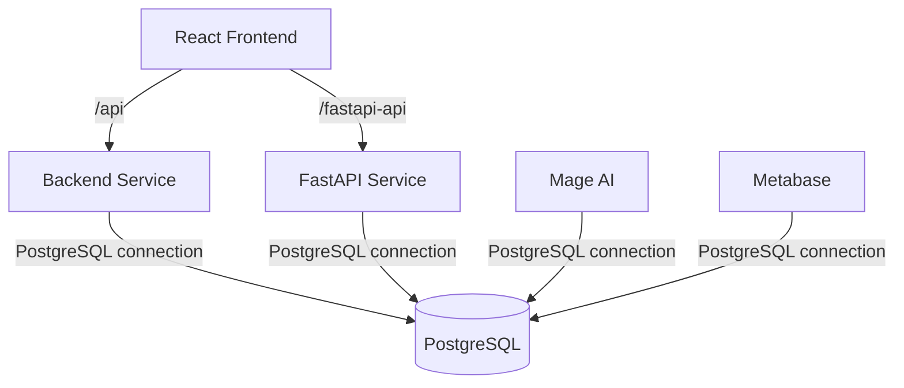

# LankaData Hub - Open Data Platform

LankaData Hub is Sri Lanka's Open Data REST API and visualization platform. It aggregates socio-economic metrics, public health statistics, monsoon weather data, and agricultural indicators.

This project uses a production-ready, containerized multi-service architecture powered by Docker Compose.

---

## 🏗️ System Architecture



### Services & Exposed Ports

| Service | Port | Description |
| :--- | :--- | :--- |
| **React Frontend** | `80` | Client web application served via Nginx |
| **Backend Service** | `8000` | Core FastAPI application serving Categories, Datasets, and Dashboards |
| **FastAPI Service** | `8001` | Independent FastAPI service container serving API Marketplace metrics |
| **PostgreSQL** | `5432` | Shared single database instance powering all applications |
| **Mage AI** | `6789` | ETL pipeline and data orchestration tool |
| **Metabase** | `3000` | BI platform for data reporting and dashboards visualization |

---

## 🚀 Deployment Guide

This project is configured for seamless deployment on a Google Cloud VM.

### Prerequisites

- Git installed
- Docker and Docker Compose (v2) installed

### Step-by-Step Installation

1. **Clone the repository:**
   ```bash
   git clone https://github.com/vibhu-kalpitha/Lankadata-Hub.git
   cd Lankadata-Hub
   ```

2. **Launch all services in detached mode:**
   ```bash
   docker compose up --build -d
   ```

   This command will:
   - Construct the shared Docker bridge network (`lankadata_net`).
   - Spawn the single `postgres` container and initialize its named volume.
   - Wait for `postgres` to be healthy, then launch `backend`.
   - Seed initial data (categories, datasets, and API specs) via `backend` startup.
   - Boot `fastapi`, `frontend`, `mage`, and `metabase` services concurrently.

3. **Verify the services are running:**
   ```bash
   docker compose ps
   ```

4. **Access the application:**
   - Open your browser at `http://<VM_IP>` to see the React frontend.
   - Access Mage AI at `http://<VM_IP>:6789`.
   - Access Metabase at `http://<VM_IP>:3000`.

---

## 🛠️ Development & Routing Configuration

### API Reverse Proxy Strategy
To prevent CORS problems and hardcoding server IP addresses into front-end build assets, LankaData Hub uses **relative routing**:
- `/api` proxies requests to the `backend` container (`http://backend:8000`).
- `/fastapi-api` proxies requests to the `fastapi` container (`http://fastapi:8001/api`).

This is handled by:
1. **Production:** Nginx (`frontend/nginx.conf`) handles reverse proxying in the frontend container.
2. **Development:** Vite dev server proxy settings (`frontend/vite.config.ts`) handles proxying to localhost when running locally.